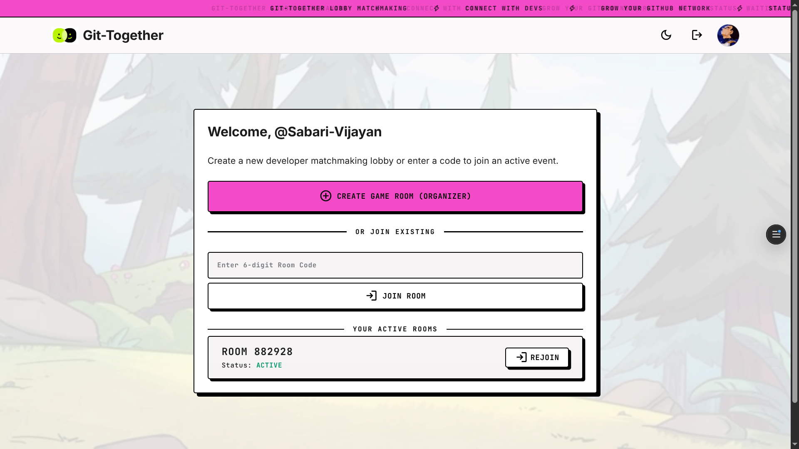
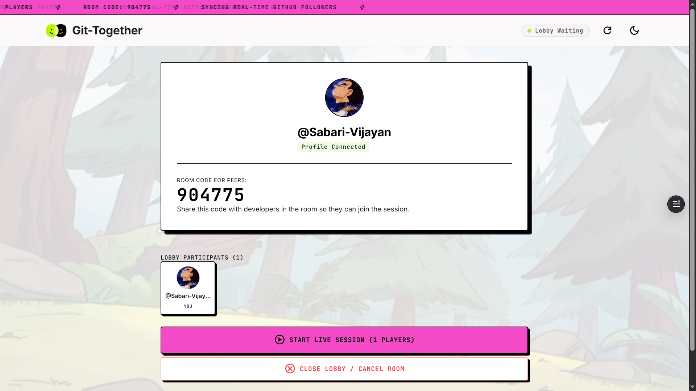
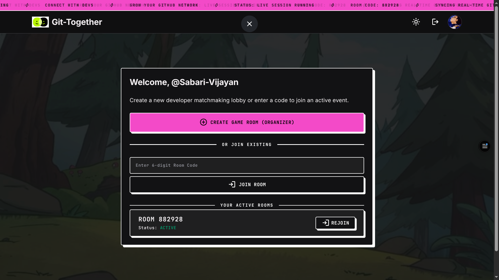
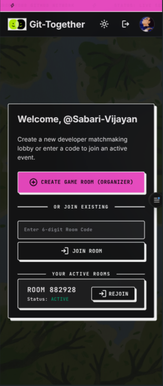
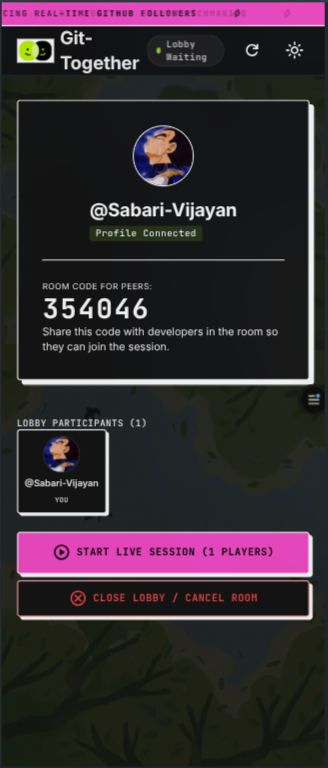

# Git-Together

## Overview
Git-Together is a premium, gamified developer networking and matchmaking web application. Tailored for hackathons and tech events in a fictional cyber-manga setting, it enables attendees to scan each other's custom QR codes, follow peers in real-time, view live leaderboards, and sync active developer connections directly back to GitHub in the background.

## Problem Statement
At typical tech events, developer networking is often awkward, passive, or transient. Swapping social handles or GitHub usernames manually is tedious, and attendees lack a compelling, interactive system to drive real engagement. There is no active reinforcement to follow back or gamify connections.

## Solution
Git-Together transforms networking into a live, competitive multiplayer game. Attendees authenticate via GitHub OAuth, join matchmaking lobbies, and display their unique personal QR codes. Using a positive-sum scoring trigger ($+0.5\text{ pt}$ for gaining a follower, $+1.0\text{ pt}$ for actively following a peer), it encourages mutual connection. Follows are logged locally in a queue-based ledger and synced to actual GitHub accounts asynchronously using Supabase Edge Functions.

## Features
- **Chainzoku Neo-Brutalist Aesthetic:** Heavy solid offset shadows, thick outline borders, and a vibrant cyber-punk theme (neon pink and radioactive lime green).
- **CRT Glitch Scanline Loader:** A retro monitor load overlay featuring a pulsing brand logo, percentage loading bar, and active terminal logging statements.
- **Lobby Start Synchronization:** Instant transitions across all participants' screens when the room organizer starts the game, powered by Supabase Realtime event listeners.
- **Interactive Instruction Countdown:** A 5-second countdown popup describing matchmaking rules and scoring guidelines displayed to everyone before active networking starts.
- **Real-Time Live Leaderboard:** Dynamic leaderboard sorting updates instantly as attendees scan QR codes and follow peers.
- **Decoupled Background Sync:** Uses a Supabase Cron edge function queue to batch and retry GitHub follow API calls, bypassing rate limits.
- **Podium Ceremony:** Gamified final rankings screen celebrating the top 3 networkers.

## Tech Stack
- Frontend: React v19.2 + TypeScript + Vite v8.0
- Backend: Supabase Edge Functions (Deno)
- Database: PostgreSQL (Supabase) + pg_cron + Realtime replication
- APIs: GitHub REST API (for automated OAuth follow mutations)
- Hosting: Vercel / Netlify / Supabase Static Hosting

## Codex / OpenAI Usage
During the development, AI tools (such as Codex and ChatGPT) were utilized for:
- **Ideation:** Crafting the Chainzoku-inspired cyberpunk/neo-brutalist theme and rules.
- **Architecture Planning:** Designing the decoupled Postgres queue trigger and background sync worker system.
- **Code Generation:** Implementing the confetti particle engine, QR code encoder/decoder components, and the CRT scanner simulation animation.
- **Debugging:** Troubleshooting Supabase Realtime UUID column filter bugs by switching to client-side UUID parsing.
- **Documentation:** Authoring schema guides and host setup parameters.
- **API Integration:** Formulating OAuth scopes and rate-limiting retry protocols.

## Demo
- [Git-Together Demo Video](screenshots/demo_of_git-together.mp4)

## Screenshots
<div align="center">
  
  
  
  
  
</div>

## Configuration & Authentication Setup

To successfully run this project locally or self-host, you must configure the following authentication components and credentials:

### 1. GitHub OAuth App Setup
1. Go to your **GitHub Settings** > **Developer Settings** > **OAuth Apps** > **New OAuth App**.
2. Register the application with:
   - **Application Name:** `Git-Together`
   - **Homepage URL:** Your local or hosted URL (e.g. `http://localhost:5173`)
   - **Authorization Callback URL:** `https://<your-supabase-project-ref>.supabase.co/auth/v1/callback`
3. Register the app, note down the **Client ID**, and generate a new **Client Secret**.

### 2. Supabase Auth Config
1. Log into your **Supabase Dashboard**, navigate to **Authentication** > **Providers** > **GitHub**.
2. Enable the provider, paste your **Client ID** and **Client Secret**, and save the settings.
3. Establish your DB schema and score triggers by executing the DDL scripts in `sql.txt` and `newsql.txt` in the Supabase SQL editor.

### 3. Environment Variables
Create a `.env` file in the root of the `/git-together` directory:
```ini
VITE_SUPABASE_URL=https://<your-supabase-project-ref>.supabase.co
VITE_SUPABASE_ANON_KEY=<your-supabase-anon-public-key>
```

## How to Run Locally

```bash
git clone <repo-url>
cd git-together
npm install
npm run dev
```
